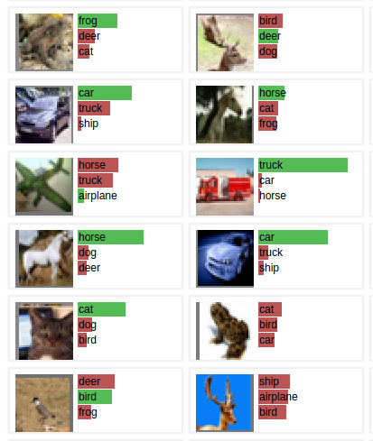
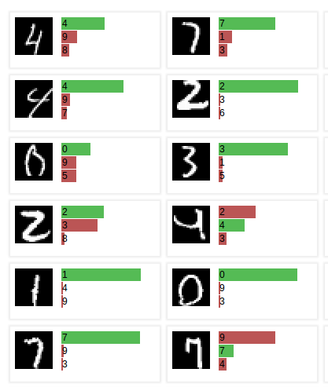

# Convolutional Neural Network from scratch

Objective of this work was to write the `Convolutional Neural Network` without using any Deep Learning Library to gain insights of what is actually happening and thus the algorithm is not optimised enough and hence is slow on large dataset like CIFAR-10.
This piece of code could be used for `learning purpose` and could be implemented with trained parameter available in the respective folders for any testing applications like `Object Detection` and `Digit recognition`.




## Getting Started

These instructions will get you a copy of the project up and running on your local machine for development and testing purposes.

### Prerequisites

* [Numpy](http://www.numpy.org/) - Multidimensioanl Mathematical Computing 
* [Matplotlib](https://matplotlib.org/contents.html) - Used to plot Graph
* [Pickle](https://docs.python.org/3/library/pickle.html) - Used to save trained models/object
* [MNIST Dataset](http://yann.lecun.com/exdb/mnist/) - Dataset for Digit Recognition
* [CIFAR-10 Dataset](http://www.cs.toronto.edu/~kriz/cifar.html) - Dataset for Object Recognition


### Directories

- `CIFAR-10 `: Object detection with [CIFAR-10](http://www.cs.toronto.edu/~kriz/cifar.html)
- `MNIST `: Handwritten Digits Recognition with [MNIST](http://yann.lecun.com/exdb/mnist/)


### Installing

Clone the repository

```
git clone https://github.com/zishansami102/Convolutional-Neural-Network-from-Scratch
```


Move into the required directory and then run the following command to start training model

```
python run.py
```

Output:


To load pre-trained models, change the pickle filename from output.pickle to trained.pickle in run.py: `line No. - 27-28` and comment out the training part form the code in run.py: `line No. - 77-104`


## Contributing

### KWoC Action Plan

#### Short term Issues

See the issue section of this repositiory

#### Long term project


Plan is to make a Web App or Mobile App which can predict the digit between 0 to 9 if the user writes anything on the app drawing board.
You can choose any one or more of the following which you like from the list down bellow and respond on the google group to start:

* A python based API which recieves image as input and gives digit prediction for that image as output
* Make the front-end of the Web/Mobile App which should have a drawing board on which digits can be drawn and integrate the API
* 

<!-- 
```
Contributions are welcome of course ;)
``` -->

## Acknowledgments

* [CS231n.stanford.edu](http://cs231n.stanford.edu/) - Most of the theorotical concepts are taken from here
* [dorajam](https://github.com/dorajam/Convolutional-Network) - Used to gain more concepts
* [Advanced Concepts](http://www.jefkine.com/general/2016/09/05/backpropagation-in-convolutional-neural-networks/) - Still need to be implemented, but helpful to gain insight
